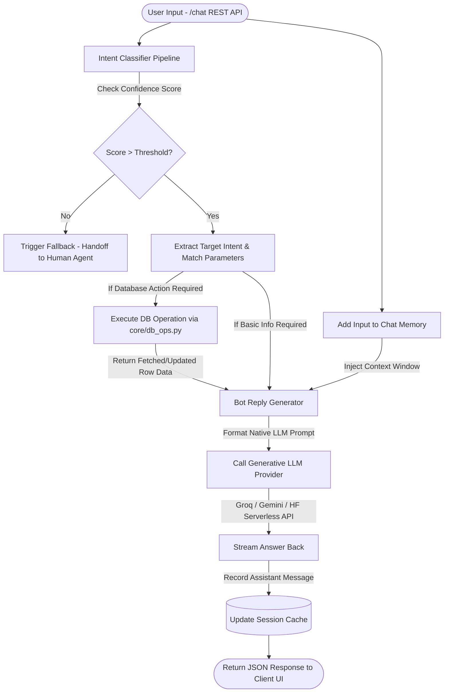

# AI-Powered Customer Support & Demand Management Chatbot

A scalable, intelligent conversational AI architecture explicitly developed using **Python, FastAPI, SQLite3, and Hugging Face Transformers**. 

This system acts as a highly integrated **Customer Support API** for E-commerce & Internal Enterprise Helpdesks. It is capable of natively scanning through internal database schemas (Orders, Demands, Projects) and executing database changes seamlessly backed by Large Language Model logic (like **Groq**, **Gemini**, or **Local Transformer** LLMs).

***

## 📑 Project Documentation
For an in-depth operational blueprint of the software features, KPIs, engineering timelines, and architecture requirements, please consult our documentation index:

- **[SOW (Statement of Work)](SOW.md)** - Timeline, objectives, and deliverables roadmap.
- **[BRD (Business Requirements)](BRD.md)** - Operational KPI goals, deflection targets, and user audience targets.
- **[FRD (Functional Requirements)](FRD.md)** - Deep dive into database state modifications, strict LLM confidence thresholds, and system architecture structures.

---


## 🗺️ Execution Flowchart

The following flowchart explains how user requests travel through the `APIRouter` into the Natural Language engines.



---

## 🚀 Features at a Glance

*   **Database Integrated Generators:** Chatbot parses regular user strings, figures out what order or demand the user is asking about, queries `sqlite3` natively across thousands of mock operations, and builds a comprehensive system prompt injected into the LLM logic on-the-fly (`BotReplyGenerator`).
*   **Safe Intent Thresholds:** The underlying local Huggingface pipeline acts as an intermediary supervisor. If an LLM or user text input goes completely out of domain, the Bot instantly isolates the request and locks it into human-moderator routing before executing malicious actions.
*   **Multi-Provider Configurations:** Seamless `.env` toggling between lightning-fast Local `DistilBERT` classifiers routing generative queries out to `groq-llama3`, `gemini-api`, or internal huggingface models. 

## 🔧 Setup Instructions

1.  **Clone the repository:**
    ```bash
    git clone https://github.com/selftaughtrahul/ai-assistant.git
    cd chatbot
    ```

2.  **Install dependencies and virtual env:**
    ```bash
    python -m venv venv
    venv\Scripts\activate
    pip install -r requirements.txt
    ```

3.  **Run automated tests:**
    ```bash
    pytest tests
    ```

4.  **Run the live production server:**
    ```bash
    uvicorn main:app --reload
    ```
    The conversational API will be live at `http://localhost:8000/`. You can view interactive Swagger documentation natively at `http://localhost:8000/docs`.

5.  **Run the Streamlit frontend:**
    ```bash
    streamlit run app.py
    ```
    This will launch the interactive Chat UI directly in your browser.
